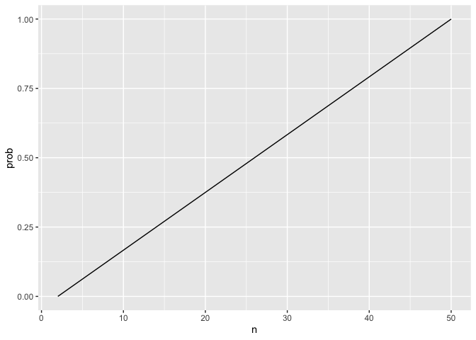
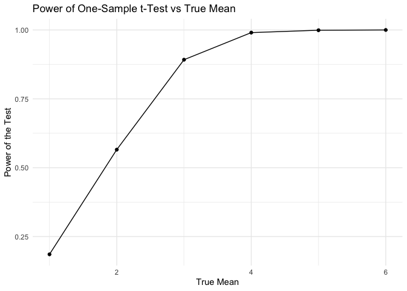
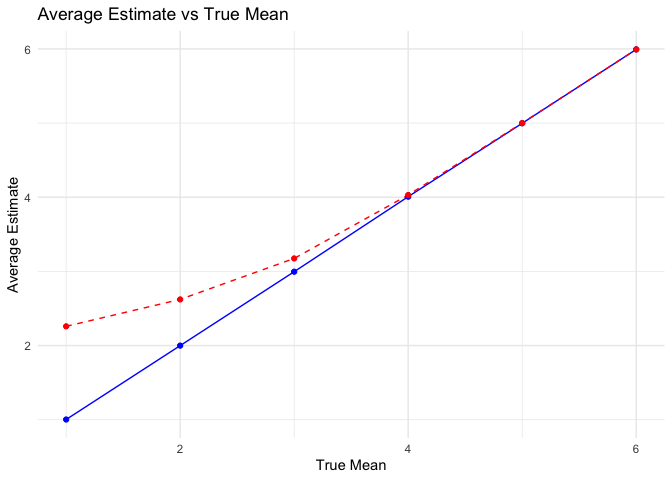
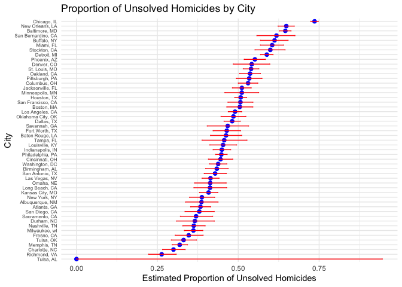

p8105_hw5_yh3822
================
2024-11-14

``` r
knitr::opts_chunk$set(echo = TRUE, warning=FALSE, message=FALSE)
library(tidyverse)
```

    ## ── Attaching core tidyverse packages ──────────────────────── tidyverse 2.0.0 ──
    ## ✔ dplyr     1.1.4     ✔ readr     2.1.5
    ## ✔ forcats   1.0.0     ✔ stringr   1.5.1
    ## ✔ ggplot2   3.5.1     ✔ tibble    3.2.1
    ## ✔ lubridate 1.9.3     ✔ tidyr     1.3.1
    ## ✔ purrr     1.0.2     
    ## ── Conflicts ────────────────────────────────────────── tidyverse_conflicts() ──
    ## ✖ dplyr::filter() masks stats::filter()
    ## ✖ dplyr::lag()    masks stats::lag()
    ## ℹ Use the conflicted package (<http://conflicted.r-lib.org/>) to force all conflicts to become errors

``` r
library(dplyr)
library(broom)
```

## Problem 1

``` r
bday_sim = function(n) {
  
  bdays = sample(1:365, size = 10, replace = TRUE)

  duplicate = length(unique(bdays)) < n
  
  return(duplicate)
  
}
```

``` r
sim_res = 
  expand_grid(
    n = c(2, 50),
    iter = 1:10000
  ) |>
  mutate(res = map_lgl(n, bday_sim)) |>
  group_by(n) |>
  summarize(prob = mean(res, na.rm = TRUE))

sim_res |>
  ggplot(aes(x = n, y = prob)) +
  geom_line()
```

<!-- -->

As the group size increases, the probability of having at least two
people with the same birthday increases.

## Problem 2

``` r
n = 30      
sigma = 5   
alpha = 0.05
mu = 0      
```

``` r
sim_t_test = function(n, mu, sigma = 5) {
  x = rnorm(n, mean = mu, sd = sigma)
  t_test <- t.test(x, mu = 0)
  tidy(t_test)
}
```

``` r
sim_results <- tibble(
  iter = 1:5000
) |>
  mutate(t_test_res = map(iter, ~sim_t_test(n, mu, sigma))) |>
  unnest(t_test_res) |>
  select(iter, estimate, p.value)
head(sim_results)
```

    ## # A tibble: 6 × 3
    ##    iter estimate p.value
    ##   <int>    <dbl>   <dbl>
    ## 1     1   0.687    0.426
    ## 2     2   0.0105   0.991
    ## 3     3  -0.533    0.491
    ## 4     4  -1.09     0.291
    ## 5     5  -0.0391   0.966
    ## 6     6   0.364    0.689

``` r
sim_results2 = expand_grid(
  mu = 1:6,
  iter = 1:5000
) |>
  mutate(t_test_res = map(mu, ~sim_t_test(n, .x, sigma))) |>
  unnest(t_test_res) 

sim_results2 |>
  group_by(mu) |>
  summarize(power = mean(p.value < alpha), .groups = "drop") |>
  ggplot(aes(x = mu, y = power)) +
  geom_line() +
  geom_point() +
  labs(
    x = "True Mean",
    y = "Power of the Test",
    title = "Power of One-Sample t-Test vs True Mean"
  ) +
  theme_minimal()
```

<!-- -->

The power diagram shows that the power (the proportion rejecting the
null hypothesis) increases rapidly as the true mean increases until the
true mean reaches 4, the power stays at 1.

``` r
sim_results2 |>
  group_by(mu) |>
  summarize(
    mean_mu_hat = mean(estimate),
    mean_mu_hat_rejected = mean(estimate[p.value < alpha]),
    .groups = "drop"
  ) |>
  ggplot(aes(x = mu)) +
  geom_line(aes(y = mean_mu_hat), color = "blue", linetype = "solid", label = "All Samples") +
  geom_line(aes(y = mean_mu_hat_rejected), color = "red", linetype = "dashed", label = "Rejected H0") +
  geom_point(aes(y = mean_mu_hat), color = "blue") +
  geom_point(aes(y = mean_mu_hat_rejected), color = "red") +
  labs(
    x = "True Mean",
    y = "Average Estimate",
    title = "Average Estimate vs True Mean"
  ) +
  theme_minimal()
```

<!-- -->

The solid blue line represents the average estimate for all samples,
which is close to the true mean. The red dashed line indicates that the
average estimate for the sample that rejects the null hypothesis is
slightly higher than the true mean in the range from 1 to 4, and the gap
decreases as the true mean increases. This is because the null
hypothesis is more likely to be rejected only when the effect is large,
resulting in higher estimates.

## Problem 3

``` r
homicide_df = read_csv("./data/homicide-data.csv") |>
  janitor::clean_names()
summary(homicide_df)
```

    ##      uid            reported_date       victim_last        victim_first      
    ##  Length:52179       Min.   : 20070101   Length:52179       Length:52179      
    ##  Class :character   1st Qu.: 20100318   Class :character   Class :character  
    ##  Mode  :character   Median : 20121216   Mode  :character   Mode  :character  
    ##                     Mean   : 20130899                                        
    ##                     3rd Qu.: 20150911                                        
    ##                     Max.   :201511105                                        
    ##                                                                              
    ##  victim_race         victim_age         victim_sex            city          
    ##  Length:52179       Length:52179       Length:52179       Length:52179      
    ##  Class :character   Class :character   Class :character   Class :character  
    ##  Mode  :character   Mode  :character   Mode  :character   Mode  :character  
    ##                                                                             
    ##                                                                             
    ##                                                                             
    ##                                                                             
    ##     state                lat             lon          disposition       
    ##  Length:52179       Min.   :25.73   Min.   :-122.51   Length:52179      
    ##  Class :character   1st Qu.:33.77   1st Qu.: -96.00   Class :character  
    ##  Mode  :character   Median :38.52   Median : -87.71   Mode  :character  
    ##                     Mean   :37.03   Mean   : -91.47                     
    ##                     3rd Qu.:40.03   3rd Qu.: -81.76                     
    ##                     Max.   :45.05   Max.   : -71.01                     
    ##                     NA's   :60      NA's   :60

The dataset contains data on homicides in 50 major U.S. cities,
including the reported date, the identity of the suspect, the location
and the status of the case. There are 52179 rows and 12 columns.

``` r
homicide_df = homicide_df |>
  mutate(city_state = str_c(city, ", ", state)) 

homicide_df |>
  group_by(city_state) |>
  summarize(total_homicides = n())
```

    ## # A tibble: 51 × 2
    ##    city_state      total_homicides
    ##    <chr>                     <int>
    ##  1 Albuquerque, NM             378
    ##  2 Atlanta, GA                 973
    ##  3 Baltimore, MD              2827
    ##  4 Baton Rouge, LA             424
    ##  5 Birmingham, AL              800
    ##  6 Boston, MA                  614
    ##  7 Buffalo, NY                 521
    ##  8 Charlotte, NC               687
    ##  9 Chicago, IL                5535
    ## 10 Cincinnati, OH              694
    ## # ℹ 41 more rows

``` r
homicide_df |>
  filter(disposition %in% c("Closed without arrest", "Open/No arrest")) |>
  group_by(city_state) |>
  summarize(unsolved_homicides = n())
```

    ## # A tibble: 50 × 2
    ##    city_state      unsolved_homicides
    ##    <chr>                        <int>
    ##  1 Albuquerque, NM                146
    ##  2 Atlanta, GA                    373
    ##  3 Baltimore, MD                 1825
    ##  4 Baton Rouge, LA                196
    ##  5 Birmingham, AL                 347
    ##  6 Boston, MA                     310
    ##  7 Buffalo, NY                    319
    ##  8 Charlotte, NC                  206
    ##  9 Chicago, IL                   4073
    ## 10 Cincinnati, OH                 309
    ## # ℹ 40 more rows

``` r
baltimore_data = homicide_df |>
  filter(city_state == "Baltimore, MD") 

total_homicides = nrow(baltimore_data)
unsolved_homicides = sum(baltimore_data$disposition %in% c("Closed without arrest", "Open/No arrest"))
```

``` r
test_output = prop.test(unsolved_homicides, total_homicides) 

test_output |>
  tidy() |>
  select(estimate, conf.low, conf.high)
```

    ## # A tibble: 1 × 3
    ##   estimate conf.low conf.high
    ##      <dbl>    <dbl>     <dbl>
    ## 1    0.646    0.628     0.663

``` r
run_prop_test = function(unsolved, total) {
  test_result = prop.test(unsolved, total)
  tidy(test_result) |>
    select(estimate, conf.low, conf.high)
}

city_test = homicide_df |>
  mutate(unsolved = disposition %in% c("Closed without arrest", "Open/No arrest")) |>
  group_by(city_state) |>
  summarize(
    total_homicides = n(),
    unsolved_homicides = sum(unsolved),
    .groups = "drop"
  ) |>
  mutate(test_summary = map2(unsolved_homicides, total_homicides, run_prop_test)) |>
  unnest(test_summary)

city_test
```

    ## # A tibble: 51 × 6
    ##    city_state     total_homicides unsolved_homicides estimate conf.low conf.high
    ##    <chr>                    <int>              <int>    <dbl>    <dbl>     <dbl>
    ##  1 Albuquerque, …             378                146    0.386    0.337     0.438
    ##  2 Atlanta, GA                973                373    0.383    0.353     0.415
    ##  3 Baltimore, MD             2827               1825    0.646    0.628     0.663
    ##  4 Baton Rouge, …             424                196    0.462    0.414     0.511
    ##  5 Birmingham, AL             800                347    0.434    0.399     0.469
    ##  6 Boston, MA                 614                310    0.505    0.465     0.545
    ##  7 Buffalo, NY                521                319    0.612    0.569     0.654
    ##  8 Charlotte, NC              687                206    0.300    0.266     0.336
    ##  9 Chicago, IL               5535               4073    0.736    0.724     0.747
    ## 10 Cincinnati, OH             694                309    0.445    0.408     0.483
    ## # ℹ 41 more rows

``` r
city_test |>
  mutate(city_state = fct_reorder(city_state, estimate)) |>
  ggplot(aes(x = estimate, y = city_state)) +
  geom_point(color = "blue", size = 2) +
  geom_errorbar(aes(xmin = conf.low, xmax = conf.high), width = 0.2, color = "red") +
  labs(
    title = "Proportion of Unsolved Homicides by City",
    x = "Estimated Proportion of Unsolved Homicides",
    y = "City"
  ) +
  theme_minimal() +
  theme(
    axis.text.y = element_text(size = 6) 
  )
```

<!-- -->
